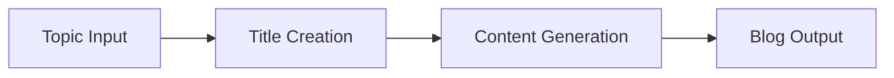
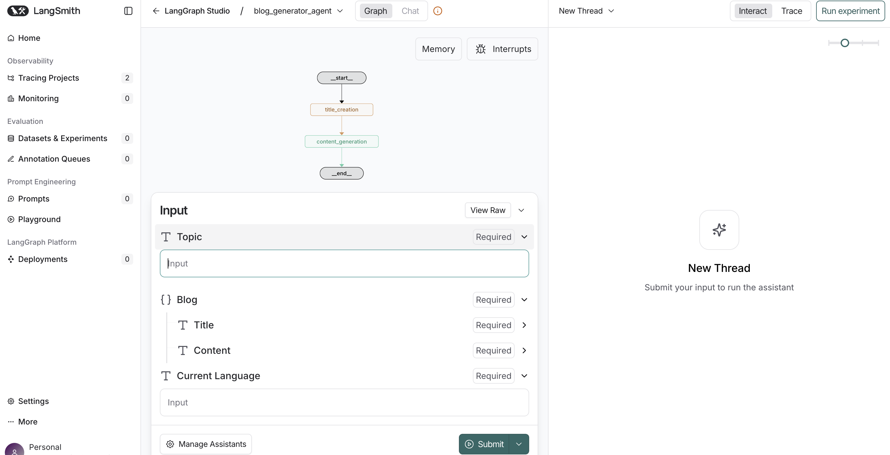
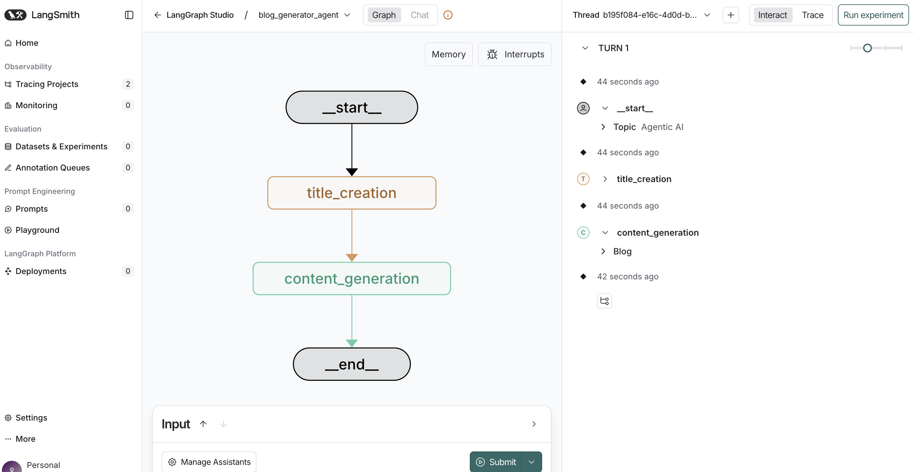
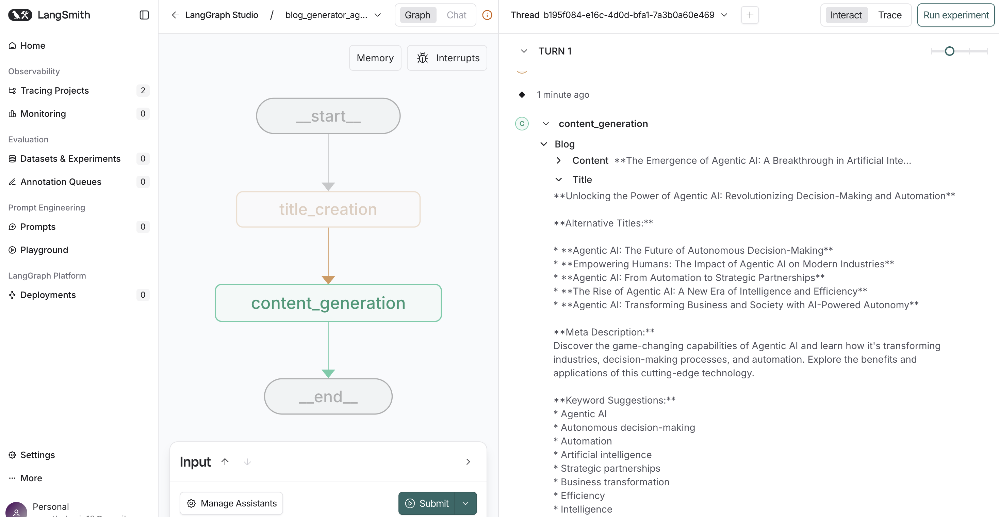

# Blog Generation Agent

A sophisticated AI-powered blog generation system built with LangGraph and FastAPI that creates high-quality, SEO-friendly blog content using Groq's LLaMA model.

## 🚀 Overview

This project implements an agentic AI system that generates comprehensive blog posts from simple topic inputs. The system uses LangGraph to orchestrate a multi-step workflow that creates both engaging titles and detailed content with proper markdown formatting.

## 🏗️ Architecture

The application follows a modular architecture with clear separation of concerns:

```
bloggeneration/
├── src/
│   ├── graphs/          # LangGraph workflow definitions
│   ├── llms/            # Language model configurations
│   ├── nodes/           # Processing nodes for blog generation
│   └── states/          # State management and data models
├── app.py               # FastAPI web server
├── main.py              # CLI entry point
└── langgraph.json       # LangGraph configuration
```

### Core Components

#### 1. **Graph Builder** (`src/graphs/graph_builder.py`)
- Orchestrates the blog generation workflow using LangGraph
- Defines the sequential processing pipeline: Topic → Title → Content
- Supports different use cases through configurable graph setups

#### 2. **Blog Node** (`src/nodes/blog_node.py`)
- **Title Creation**: Generates creative, SEO-friendly blog titles
- **Content Generation**: Creates detailed blog content with markdown formatting
- Uses structured prompts to ensure consistent, high-quality output

#### 3. **LLM Integration** (`src/llms/groqllm.py`)
- Integrates with Groq's LLaMA-3.1-8B-Instant model
- Handles API key management and model configuration
- Provides error handling for LLM interactions

#### 4. **State Management** (`src/states/blogstate.py`)
- Defines the data flow structure using TypedDict and Pydantic models
- Manages blog state including topic, title, content, and language
- Ensures type safety throughout the workflow

## 🛠️ Technology Stack

- **LangGraph**: Workflow orchestration and state management
- **LangChain**: LLM integration and prompt management
- **FastAPI**: High-performance web API framework
- **Groq**: Fast inference with LLaMA models
- **Pydantic**: Data validation and serialization
- **Uvicorn**: ASGI server for production deployment

## 📋 Prerequisites

- Python 3.13+
- Groq API key
- LangChain API key (for LangSmith tracing)

## 🚀 Installation

1. **Clone the repository**:
   ```bash
   git clone <repository-url>
   cd bloggeneration
   ```

2. **Set up virtual environment**:
   ```bash
   python -m venv .venv
   source .venv/bin/activate  # On Windows: .venv\Scripts\activate
   ```

3. **Install dependencies**:
   ```bash
   pip install -r requirements.txt
   # or using uv
   uv sync
   ```

4. **Configure environment variables**:
   Create a `.env` file in the root directory:
   ```env
   GROQ_API_KEY=your_groq_api_key_here
   LANGCHAIN_API_KEY=your_langchain_api_key_here
   ```

## 🎯 Usage

### Web API

1. **Start the FastAPI server**:
   ```bash
   python app.py
   # or
   uvicorn app:app --host 0.0.0.0 --port 8000 --reload
   ```

2. **Generate a blog post**:
   ```bash
   curl -X POST "http://localhost:8000/blogs" \
        -H "Content-Type: application/json" \
        -d '{"topic": "Agentic AI"}'
   ```

3. **Example response**:
   ```json
   {
     "data": {
       "topic": "Agentic AI",
       "blog": {
         "title": "# The Future of Autonomous Intelligence: Understanding Agentic AI",
         "content": "## Introduction\n\nAgentic AI represents..."
       }
     }
   }
   ```

### LangGraph Studio

The project is configured for LangGraph Studio development:

1. **Start LangGraph Studio**:
   ```bash
   langgraph dev
   ```

2. **Access the visual interface** at the provided URL to:
   - Visualize the workflow graph
   - Debug state transitions
   - Monitor execution traces

### CLI Usage

```bash
python main.py
```

## 🔧 Configuration

### LangGraph Configuration (`langgraph.json`)
```json
{
    "dependencies": ["."],
    "graphs": {
        "blog_generator_agent": "./src/graphs/graph_builder.py:graph"
    },
    "env": "./.env"
}
```

### Project Configuration (`pyproject.toml`)
- Project metadata and dependencies
- Python version requirements (>=3.13)
- Development and production dependencies

## 📊 Workflow

The blog generation follows this sequential workflow:



1. **Input**: User provides a topic
2. **Title Creation**: AI generates an SEO-friendly title
3. **Content Generation**: AI creates detailed blog content
4. **Output**: Complete blog post with title and content

## 🎨 Features

- **SEO-Optimized Content**: Generates titles and content optimized for search engines
- **Markdown Formatting**: Proper markdown structure for easy publishing
- **Modular Architecture**: Easy to extend with new nodes and workflows
- **Type Safety**: Full type checking with Pydantic models
- **Error Handling**: Robust error handling throughout the pipeline
- **Development Tools**: Integration with LangGraph Studio for visual debugging
- **Production Ready**: FastAPI server with proper async handling

## 🔍 API Endpoints

### POST `/blogs`
Generates a blog post from a given topic.

**Request Body**:
```json
{
  "topic": "string"
}
```

**Response**:
```json
{
  "data": {
    "topic": "string",
    "blog": {
      "title": "string",
      "content": "string"
    }
  }
}
```

## 🧪 Development

### Project Structure
- `src/`: Source code modules
- `.langgraph_api/`: LangGraph runtime data and checkpoints
- `images/`: Documentation assets
- `.venv/`: Virtual environment
- `__pycache__/`: Python bytecode cache

### Adding New Features

1. **New Nodes**: Add processing nodes in `src/nodes/`
2. **New States**: Define state models in `src/states/`
3. **New Graphs**: Create workflow definitions in `src/graphs/`
4. **New LLMs**: Add model integrations in `src/llms/`

## 🚀 Deployment

The application is production-ready with:
- FastAPI for high-performance API serving
- Uvicorn ASGI server
- Environment-based configuration
- Proper error handling and logging

## 🤝 Contributing

1. Fork the repository
2. Create a feature branch
3. Make your changes
4. Add tests if applicable
5. Submit a pull request

## 🆘 Support

For issues and questions:
1. Check the existing issues
2. Create a new issue with detailed description
3. Include error logs and environment details

---

**Built with ❤️ using LangGraph, FastAPI, and Groq AI**

## Output

  
<br><br>

  
<br><br>


